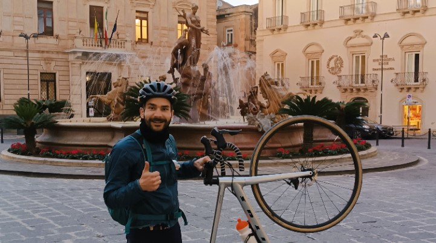

### Welcome to my Profile! 👋

- Full-Stack Web Developer based in Berlin, Germany

 - Current status: open to work, studying React Native and App Router after having graduated from SPICED Academy WebDev Boot Camp end of April 2024 💻

 - Skills 💪

|  | beginner | intermediate | expert |
| ----------- | ----------- | ----------- | ----------- |
| NextJS |  | **X** |  |
| react |  | **X** |  |
| JavaScript |  | **X** |  |
| TypeScript |  | **X** |  |
| React Native | **X** |  |  |
| CSS |  |  | **X** |
| Tailwind |  | **X** |  |
| HTML |  |  | **X** |

 - hobbies: cycling 🚴, reading 📖, board games 🎲, MPB 🎶
 - looking for interesting people 💬 and a WebDev job to continue this exciting forniture

<!--
**FlorLutz/FlorLutz** is a ✨ _special_ ✨ repository because its `README.md` (this file) appears on your GitHub profile.

Here are some ideas to get you started:

- 🔭 I’m currently working on ...
- 🌱 I’m currently learning ...
- 👯 I’m looking to collaborate on ...
- 🤔 I’m looking for help with ...
- 💬 Ask me about ...
- 📫 How to reach me: ...
- 😄 Pronouns: ...
- ⚡ Fun fact: ...
-->
